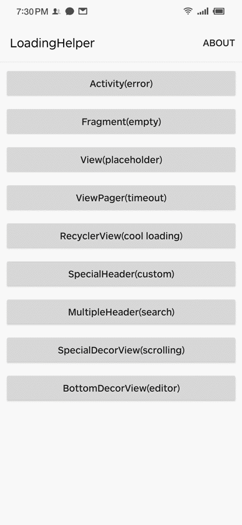
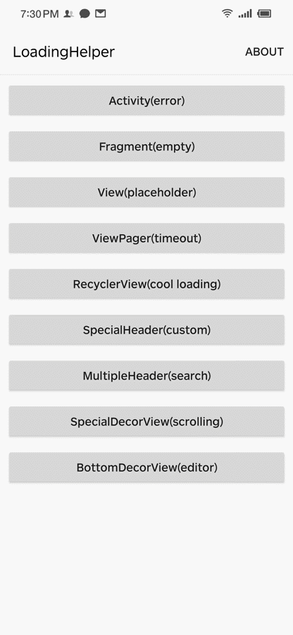
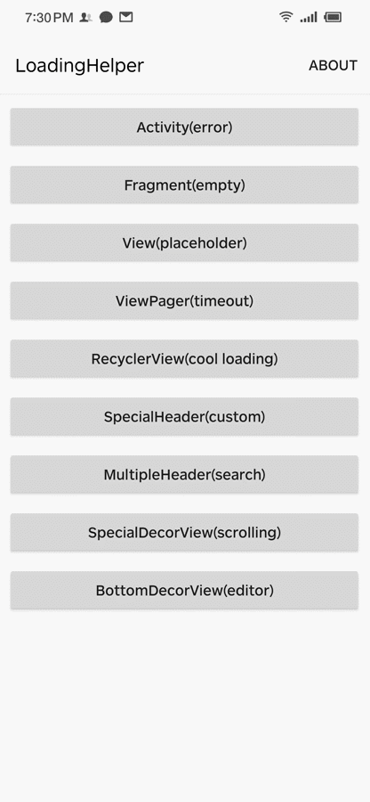

# LoadingStateView

[English](README.md) | 中文

[](https://www.jitpack.io/#DylanCaiCoding/LoadingLoadingStateView) [](https://github.com/DylanCaiCoding/LoadingStateView/blob/master/LICENSE)

`LoadingStateView` 是一个深度解耦缺省页和标题栏的工具，核心功能的实现代码只有一个 200 多行的 [Kotlin 文件](https://github.com/DylanCaiCoding/LoadingStateView/blob/master/loadingstateview/src/main/java/com/dylanc/loadingstateview/LoadingStateView.kt)。不仅能在请求网络数据时显示加载中、加载成功、加载失败、无数据的视图或自定义视图，还可以对标题栏进行解耦。 

**重大更新：结合 Kotlin 语法特性能快速将所有功能集成到基类，不会影响已有代码。移除了 `ViewHolder`，整体用法得到进一步简化，建议升级！**

- 无需在布局添加视图代码
- 支持快速集成到基类，并且不影响有代码（仅 Kotlin）
- 支持 Activity、Fragment、列表或指定的 View
- 支持显示自定义视图
- 支持添加多个头部控件
- 支持设置重新请求数据的事件
- 支持动态更新视图样式
- 可结合绝大部分第三方控件使用

## 示例

点击或者扫描二维码下载

[](https://www.pgyer.com/loadinghelper)

动态添加加载状态的布局：

| [Activity(error)](https://github.com/DylanCaiCoding/LoadingStateView/blob/master/sample-java/src/main/java/com/dylanc/loadingstateview/sample/java/ui/ActErrorActivity.java) | [View(placeholder)](https://github.com/DylanCaiCoding/LoadingStateView/blob/master/sample-java/src/main/java/com/dylanc/loadingstateview/sample/java/ui/ViewPlaceholderActivity.java) | [ViewPager(timeout)](https://github.com/DylanCaiCoding/LoadingStateView/blob/master/sample-java/src/main/java/com/dylanc/loadingstateview/sample/java/ui/ViewPagerActivity.java) | [RecyclerView(cool loading)](https://github.com/DylanCaiCoding/LoadingStateView/blob/master/sample-java/src/main/java/com/dylanc/loadingstateview/sample/java/ui/RecyclerViewActivity.java) |
| :----------------------------------------------------------: | :----------------------------------------------------------: | :----------------------------------------------------------: | :----------------------------------------------------------: |
|                                   |                                 |                                |                             |

动态添加标题栏或装饰容器：

| [SpecialHeader(custom)](https://github.com/DylanCaiCoding/LoadingStateView/blob/master/sample-java/src/main/java/com/dylanc/loadingstateview/sample/java/ui/CustomHeaderActivity.java) | [MultipleHeader(search)](https://github.com/DylanCaiCoding/LoadingStateView/blob/master/sample-java/src/main/java/com/dylanc/loadingstateview/sample/java/ui/MultipleHeaderActivity.java) | [SpecialDecorView(scrolling)](https://github.com/DylanCaiCoding/LoadingStateView/blob/master/sample-java/src/main/java/com/dylanc/loadingstateview/sample/java/ui/ScrollingToolbarActivity.java) | [BottomDecorView(editor)](https://github.com/DylanCaiCoding/LoadingStateView/blob/master/sample-java/src/main/java/com/dylanc/loadingstateview/sample/java/ui/BottomEditorActivity.java) |
| :----------------------------------------------------------: | :----------------------------------------------------------: | :----------------------------------------------------------: | :----------------------------------------------------------: |
|                            |                           |                          |                              |

## 用法

:pencil: **[>> 使用文档 <<](https://dylancaicoding.github.io/LoadingStateView)**

## Gradle

在根目录的 `build.gradle` 添加:

```groovy
allprojects {
    repositories {
        // ...
        maven { url 'https://www.jitpack.io' }
    }
}
```

在模块的 `build.gradle` 添加依赖：

```groovy
dependencies {
    // java
    implementation 'com.github.DylanCaiCoding.LoadingStateView:loadingstateview:5.0.0'

    // kotlin
    implementation 'com.github.DylanCaiCoding.LoadingStateView:loadingstateview-ktx:5.0.0'
}
```

## 更新日志

[Releases](https://github.com/DylanCaiCoding/LoadingStateView/releases)

## 作者其它的库

| 库                                                           | 简介                                           |
| ------------------------------------------------------------ | ---------------------------------------------- |
| [Longan](https://github.com/DylanCaiCoding/Longan)           | 可能是最好用的 Kotlin 工具库                  |
| [ViewBindingKTX](https://github.com/DylanCaiCoding/ViewBindingKTX) | 最全面的 ViewBinding 工具                      |
| [MMKV-KTX](https://github.com/DylanCaiCoding/MMKV-KTX)       | 最灵活易用的 MMKV 工具                              |
| [Tracker](https://github.com/DylanCaiCoding/Tracker)         | 基于西瓜视频的责任链埋点思路实现的轻量级埋点框架          |

## 感谢

- [luckbilly/Gloading](https://github.com/luckybilly/Gloading) 站在了巨人肩膀上优化了本库，非常感谢！
- [drakeet/MultiType](https://github.com/drakeet/MultiType) 参考了注册配置多适配器的思想和用法
- [dinuscxj/LoadingDrawable](https://github.com/dinuscxj/LoadingDrawable) 示例中的自定义加载动画

## License

```
Copyright (C) 2019. Dylan Cai

Licensed under the Apache License, Version 2.0 (the "License");
you may not use this file except in compliance with the License.
You may obtain a copy of the License at

   http://www.apache.org/licenses/LICENSE-2.0

Unless required by applicable law or agreed to in writing, software
distributed under the License is distributed on an "AS IS" BASIS,
WITHOUT WARRANTIES OR CONDITIONS OF ANY KIND, either express or implied.
See the License for the specific language governing permissions and
limitations under the License.
```
