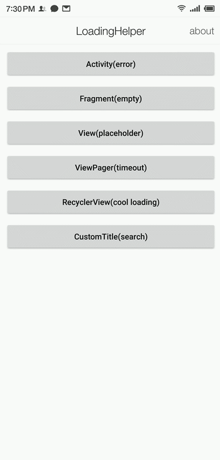
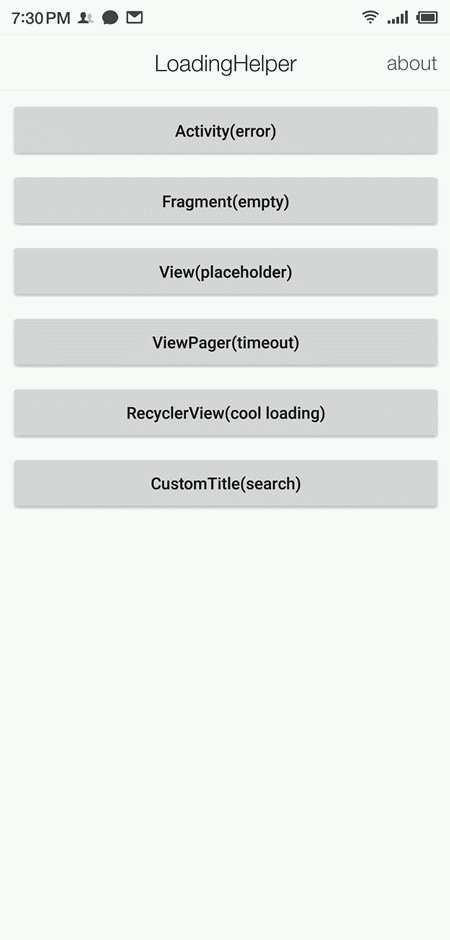

# LoadingHelper

[English](README.md) | 中文

LoadingHelper 是一个用于管理加载视图的拓展性高、低耦合的 Android 库。不只是用于请求网络数据或本地数据时，显示加载中、加载成功、加载失败、无数据或自定义视图，还可以添加标题栏，方便在 Activity 或 Fragment 使用。

- 深度解耦加载中、加载成功、加载失败、无数据的视图，可拓展自定义视图
- 无需在 xml 文件增加代码
- 可用于 Activity、Fragment、列表或指定的 View
- 可动态管理标题栏视图
- 可动态更新视图样式
- 可为视图动态增加功能方法
- 可结合大部分第三方控件使用

## 示例

[Activity(error)](/app/src/main/java/com/dylanc/loadinghelper/sample/practise/ActErrorActivity.java)|[Fragment(empty)](app/src/main/java/com/dylanc/loadinghelper/sample/practise/FragmentEmptyActivity.java)|[View(placeholder)](app/src/main/java/com/dylanc/loadinghelper/sample/practise/ViewPlaceholderActivity.java)
:---:|:---:|:---:
||

[ViewPager(timeout)](app/src/main/java/com/dylanc/loadinghelper/sample/practise/ViewPagerActivity.java)|[RecyclerView(cool loading)](app/src/main/java/com/dylanc/loadinghelper/sample/practise/RecyclerViewActivity.java)|[CustomTitle(search)](app/src/main/java/com/dylanc/loadinghelper/sample/practise/SearchTitleActivity.java)
:---:|:---:|:---:
||

[点击这里](https://madeqr.com/loadinghelper) 或者扫描二维码下载


## 使用

在 project 的 build.gradle 添加以下代码

```
allprojects {
  repositories {
    ...
    maven { url 'https://www.jitpack.io' }
  }
}
```

在 module 的 build.gradle 添加依赖

```
dependencies {
  implementation 'com.github.DylanCaiCoding:LoadingHelper:1.0.0-alpha'
}
```

### 用法

继承 LoadingHelper.Adapter&lt;VH extends ViewHolder&gt;，用法与 RecyclerView.Adapter 类似：

```
public class LoadingAdapter extends LoadingHelper.Adapter<LoadingHelper.ViewHolder> {
  
  @NonNull
  @Override
  public LoadingHelper.ViewHolder onCreateViewHolder(@NonNull LayoutInflater inflater, @NonNull ViewGroup parent) {
    return new LoadingHelper.ViewHolder(inflater.inflate(R.layout.lce_layout_loading_view, parent, false));
  }

  @Override
  public void onBindViewHolder(@NonNull LoadingHelper.ViewHolder holder) {

  }
}
```

调用 register(int viewType, LoadingHelper.Adapter adapter) 注册对应类型的 Adapter：

```
LoadingHelper loadingHelper = new LoadingHelper(this);
loadingHelper.register(ViewType.LOADING, new LoadingAdapter());

// if you want to register global adapter
LoadingHelper.getDefault().register(ViewType.LOADING, new LoadingAdapter());
```

显示对应类型的视图：

```
loadingHelper.showView(viewType);
loadingHelper.showLoadingView(); // view type is ViewType.LOADING
loadingHelper.showContentView(); // view type is ViewType.CONTENT
loadingHelper.showErrorView(); // view type is ViewType.ERROR
loadingHelper.showEmptyView(); // view type is ViewType.EMPTY
```

如需重新加载数据：

```
LoadingHelper.setOnReloadListener(new LoadingHelper.OnReloadListener() {
  @Override
  public void onReload() {
    // request data again
  }
});

holder.getOnReloadListener.onReload();
```

### 高级用法

#### 添加标题栏

创建标题栏的 Adapter，建议传入数据进行配置。

```
public class TitleConfig {
  private String mTitleText;
  private Type mType;
  // omit get set method
  public enum Type {
    BACK, NO_BACK
  }
}

public class TitleAdapter extends LoadingHelper.Adapter<TitleViewHolder> {
  private TitleConfig mConfig;

  public TitleAdapter(TitleConfig config) {
    mConfig = config;
  }

  @Override
  public TitleViewHolder onCreateViewHolder(@NonNull LayoutInflater inflater, @NonNull ViewGroup parent) {
    return new TitleViewHolder(new Toolbar(parent.getContext()));
  }

  @Override
  public void onBindViewHolder(@NonNull final TitleViewHolder holder) {
    if (mConfig != null) {
      // change view according to configuration
    }
  }
}
```

注册 Adapter，调用 addTitleView() 或 addHeaderView(int viewType) 增加标题栏。

```
final TitleConfig config = new TitleConfig();
config.setTitleText("title");
config.setType(TitleConfig.Type.BACK);
loadingHelper.register(ViewType.TITLE, new TitleAdapter(config));
loadingHelper.addTitleView();
```

#### 动态更新数据

与 RecyclerView 用法类似，调用 notifyDataSetChanged()，会执行 Adapter#onBindViewHolder(holder)。

```
mTitleAdapter = new TitleAdapter(mTitleConfig);
loadingHelper.register(ViewType.TITLE, mTitleAdapter);

mTitleConfig.setTitleText("other title");
mTitleAdapter.notifyDataSetChanged();
```

#### 解耦 Activity 基类

继承 LoadingHelper.Adapter&lt;VH extends ContentViewHolder&gt，例如：

```
public class SimpleContentAdapter extends LoadingHelper.ContentAdapter<SimpleContentAdapter.ViewHolder> {
  @Override
  public ViewHolder onCreateViewHolder(@NonNull LayoutInflater inflater, @NonNull ViewGroup parent,
                                       @NonNull View contentView) {
    return new ViewHolder(contentView);
  }

  @Override
  public void onBindViewHolder(@NonNull ViewHolder holder) {

  }

  class ViewHolder extends LoadingHelper.ContentViewHolder {

    ViewHolder(@NonNull View rootView) {
      super(rootView);
    }

    @Override
    public void onCreate(@Nullable Activity activity) {
      super.onCreate(activity);
      if (activity != null) {
        // do what you want
      }
    }
  }
}
```
创建 LoadingHelper 的时候传入 ContentAdapter。

```
LoadingHelper loadingHelper = new LoadingHelper(this, new SimpleContentAdapter());
```


## 感谢

- [luckbilly/Gloading](https://github.com/luckybilly/Gloading) 
- [drakeet/MultiType](https://github.com/drakeet/MultiType) 

## License

```
Copyright (C) 2019. Dylan Cai

Licensed under the Apache License, Version 2.0 (the "License");
you may not use this file except in compliance with the License.
You may obtain a copy of the License at

   http://www.apache.org/licenses/LICENSE-2.0

Unless required by applicable law or agreed to in writing, software
distributed under the License is distributed on an "AS IS" BASIS,
WITHOUT WARRANTIES OR CONDITIONS OF ANY KIND, either express or implied.
See the License for the specific language governing permissions and
limitations under the License.
```