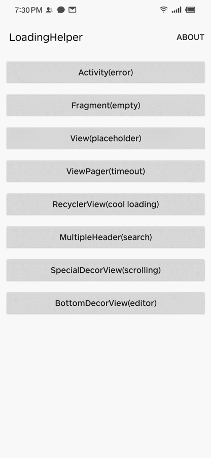
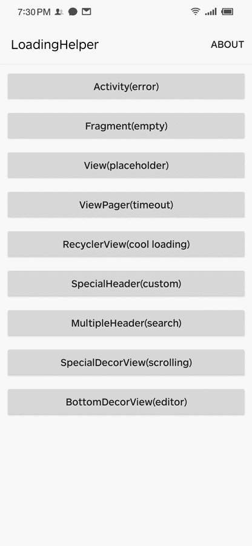
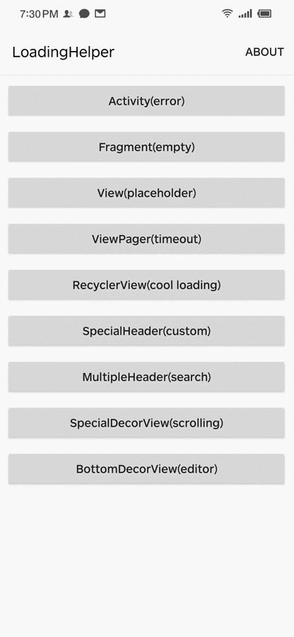

# LoadingHelper

[English](README.md) | 中文

[](https://bintray.com/dylancai/maven/loadinghelper/_latestVersion) [](https://github.com/DylanCaiCoding/LoadingHelper/blob/master/LICENSE) 

`LoadingHelper` 是一个深度解耦加载界面和标题栏的工具，只用了一个 Kotlin 文件实现，不算上注释只有 200 多行代码。不仅能在请求网络数据时**显示加载中、加载成功、加载失败、无数据的视图或自定义视图**，还可以**对标题栏进行管理**。详细的标题栏用法可以查看这篇文章[《史上耦合度最低的添加标题栏方式》](https://juejin.im/post/5ef01e22e51d4573eb40dab1)。

- 无需在布局添加视图代码
- 可显示自定义视图
- 可用于 Activity、Fragment、列表或指定的 View
- 可管理标题栏和添加多个头部控件
- 可设置重新请求数据的事件
- 可动态更新视图样式
- 可结合绝大部分第三方控件使用
- 可对内容进行预处理

## 示例

点击或者扫描二维码下载

[](https://www.pgyer.com/loadinghelper)

动态添加加载状态的布局：

| [Activity(error)](app/src/main/java/com/dylanc/loadinghelper/sample/ui/ActErrorActivity.java) | [View(placeholder)](app/src/main/java/com/dylanc/loadinghelper/sample/ui/ViewPlaceholderActivity.java) | [ViewPager(timeout)](app/src/main/java/com/dylanc/loadinghelper/sample/ui/ViewPagerActivity.java) | [RecyclerView(cool loading)](app/src/main/java/com/dylanc/loadinghelper/sample/ui/RecyclerViewActivity.java) |
| :---: | :----: | :---: | :---: |
|  |  |  |  |

动态添加标题栏或装饰容器：

| [SpecialHeader(custom)](app/src/main/java/com/dylanc/loadinghelper/sample/ui/CustomHeaderActivity.java) | [MultipleHeader(search)](app/src/main/java/com/dylanc/loadinghelper/sample/ui/MultipleHeaderActivity.java) | [SpecialDecorView(scrolling)](app/src/main/java/com/dylanc/loadinghelper/sample/ui/ScrollingToolbarActivity.java) | [BottomDecorView(editor)](app/src/main/java/com/dylanc/loadinghelper/sample/ui/BottomEditorActivity.java) |
| :---: | :---: | :---: | :---: |
|  |  |  |  |


## 开始使用

在 `build.gradle` 添加依赖：

```
dependencies {
  implementation 'com.dylanc:loadinghelper:2.1.0'
}
```

### 基础用法

第一步，创建一个适配器继承  `LoadingHelper.Adapter<VH extends ViewHolder>`，写法与 `RecyclerView.Adapter` 类似。如果需要实现点击重新请求数据，可以在点击事件调用 holder.getOnReloadListener.onReload() 方法。

```java
public class LoadingAdapter extends LoadingHelper.Adapter<LoadingHelper.ViewHolder> {

  @NonNull
  @Override
  public LoadingHelper.ViewHolder onCreateViewHolder(@NonNull LayoutInflater inflater, @NonNull ViewGroup parent) {
    return new LoadingHelper.ViewHolder(inflater.inflate(R.layout.layout_loading_view, parent, false));
  }

  @Override
  public void onBindViewHolder(@NonNull LoadingHelper.ViewHolder holder) {

  }
}
```

第二步，注册适配器，关联一个视图类型。有五个默认类型，也可以传任意类型数据进行注册。

```java
LoadingHelper loadingHelper = new LoadingHelper(this);
loadingHelper.register(ViewType.LOADING, new LoadingAdapter());
// 当需要支持点击重新请求数据时
loadingHelper.setOnReloadListener(() -> {})
```

如果想注册成全局的适配器，需要配置默认的适配器池。

```java
LoadingHelper.setDefaultAdapterPool(adapterPool -> {
  adapterPool.register(ViewType.LOADING, new LoadingAdapter());
  return Unit.INSTANCE;
});
```

第三步，显示对应类型的视图。

```java
loadingHelper.showView(viewType);
loadingHelper.showLoadingView(); // 对应视图类型 ViewType.LOADING
loadingHelper.showContentView(); // 对应视图类型 ViewType.CONTENT
loadingHelper.showErrorView(); // 对应视图类型 ViewType.ERROR
loadingHelper.showEmptyView(); // 对应视图类型 ViewType.EMPTY
```

**动态更新已显示视图**

在显示了视图之后，可以对视图进行更改刷新。用法和 `RecyclerView.Adapter` 一样，调用 `notifyDataSetChanged()` 后，会执行适配器的 `onBindViewHolder()` 方法。

```java
ErrorAdapter errorAdapter = loadingHelper.getAdapter(ViewType.ERROR);
errorAdapter.errorText = "服务器繁忙，请稍后重试";
errorAdapter.notifyDataSetChanged();
```

### 高级用法

#### 添加标题栏

如果是**普通的标题栏**，就是简单地在内容的上方添加标题栏：

和前面的用法类似，先创建一个继承  `LoadingHelper.Adapter<VH extends ViewHolder>` 的标题栏适配器，然后就能在内容的上方添加标题栏了，可以添加多个头部。

```java
loadingHelper.register(ViewType.TITLE, new TitleAdapter("标题名"));
loadingHelper.register(VIEW_TYPE_SEARCH, new SearchHeaderAdapter(onSearchListener));
loadingHelper.setDecorHeader(ViewType.TITLE, VIEW_TYPE_SEARCH);
```

如果是**特殊的标题栏**，比如有联动效果，就不能直接使用上面的方式了。这时我们要给内容增加个装饰的容器。

先实现一个不含内容的布局。

```xml
<?xml version="1.0" encoding="utf-8"?>
<androidx.coordinatorlayout.widget.CoordinatorLayout xmlns:android="http://schemas.android.com/apk/res/android"
  xmlns:app="http://schemas.android.com/apk/res-auto"
  android:layout_width="match_parent"
  android:layout_height="match_parent"
  android:fitsSystemWindows="true">

  <com.google.android.material.appbar.AppBarLayout
    android:id="@+id/app_bar"
    android:layout_width="match_parent"
    android:layout_height="@dimen/app_bar_height"
    android:fitsSystemWindows="true"
    android:theme="@style/AppTheme.AppBarOverlay">

    <com.google.android.material.appbar.CollapsingToolbarLayout
      android:id="@+id/toolbar_layout"
      android:layout_width="match_parent"
      android:layout_height="match_parent"
      android:fitsSystemWindows="true"
      app:contentScrim="?attr/colorPrimary"
      app:layout_scrollFlags="scroll|exitUntilCollapsed"
      app:toolbarId="@+id/toolbar">

      <androidx.appcompat.widget.Toolbar
        android:id="@+id/toolbar"
        android:layout_width="match_parent"
        android:layout_height="?attr/actionBarSize"
        app:layout_collapseMode="pin"
        app:popupTheme="@style/AppTheme.PopupOverlay" />

    </com.google.android.material.appbar.CollapsingToolbarLayout>
  </com.google.android.material.appbar.AppBarLayout>

  <FrameLayout
    android:id="@+id/content_parent"
    android:layout_width="match_parent"
    android:layout_height="match_parent"
    app:layout_behavior="@string/appbar_scrolling_view_behavior" />

</androidx.coordinatorlayout.widget.CoordinatorLayout>
```

创建一个类继承另一个适配器 `LoadingHelper.DecorAdapter` ，加载实现的布局，并指定一个添加内容的容器。

```java
public class ScrollDecorAdapter extends LoadingHelper.DecorAdapter {
  @NotNull
  @Override
  public View onCreateDecorView(@NotNull LayoutInflater inflater) {
    return inflater.inflate(R.layout.layout_scrolling, null);
  }

  @NotNull
  @Override
  public ViewGroup getContentParent(@NotNull View decorView) {
    return decorView.findViewById(R.id.content_parent);
  }
}
```

最后设置一下就可以了。

```java
loadingHelper.setDecorAdapter(new ScrollDecorAdapter());
```

上述的两种使用方式都是可以进行多次设置，不过每次设置会把上一次设置的样式给替换掉。

#### 预处理内容视图

创建一个适配器继承 `LoadingHelper.ContentAdapter<VH extends ViewHolder>`。如果想要使用 Activity 对象，可以在构造方法传入或者通过 contentView 获得。

```java
public class CommonContentAdapter extends LoadingHelper.ContentAdapter<LoadingHelper.ViewHolder> {
  @Override
  public LoadingHelper.ViewHolder onCreateViewHolder(@NonNull View contentView) {
    return new LoadingHelper.ViewHolder(contentView);
  }

  @Override
  public void onBindViewHolder(@NonNull LoadingHelper.ViewHolder holder) {
    View contentView = holder.getRootView();
  }
}
```

在创建 `LoadingHelper` 对象时传入 `ContentAdapter` 对象，就会立即对内容视图进行处理。

```java
loadingHelper= new LoadingHelper(this, new CommonContentAdapter());
```

## 问题反馈

遇到问题或者看了文档和 Demo 代码后仍有使用上的疑问，可以提 [issue](https://github.com/DylanCaiCoding/LoadingHelper/issues) 或者 加群 [1128654865](https://jq.qq.com/?_wv=1027&k=FUC5g86E) 交流。 

## 感谢

- [luckbilly/Gloading](https://github.com/luckybilly/Gloading) 站在了巨人肩膀上优化了本库，非常感谢！
- [drakeet/MultiType](https://github.com/drakeet/MultiType) 参考了注册配置多适配器的思想和用法
- [dinuscxj/LoadingDrawable](https://github.com/dinuscxj/LoadingDrawable) 示例中的自定义加载动画

## License

```
Copyright (C) 2019. Dylan Cai

Licensed under the Apache License, Version 2.0 (the "License");
you may not use this file except in compliance with the License.
You may obtain a copy of the License at

   http://www.apache.org/licenses/LICENSE-2.0

Unless required by applicable law or agreed to in writing, software
distributed under the License is distributed on an "AS IS" BASIS,
WITHOUT WARRANTIES OR CONDITIONS OF ANY KIND, either express or implied.
See the License for the specific language governing permissions and
limitations under the License.
```
