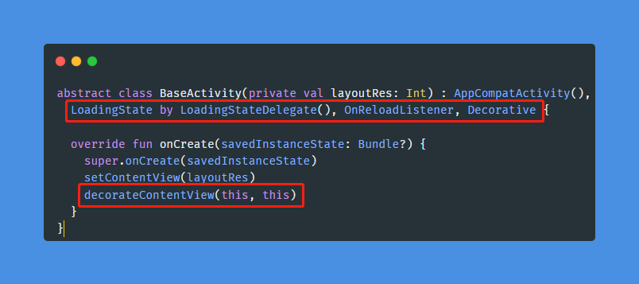
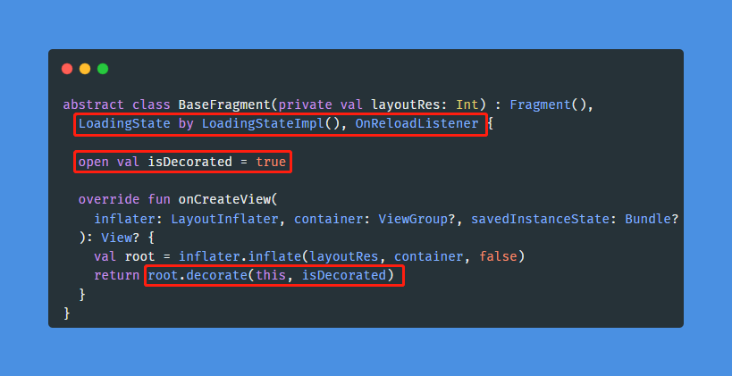

# Kotlin 委托用法

## 准备工作

需要修改基类，只需简单的几步就可以把本库的功能集成到基类，并且不会影响到已有的代码，只是给基类扩展了新的方法。

添加依赖：

```groovy
dependencies {
  implementation 'com.github.DylanCaiCoding.LoadingStateView:loadingstateview-ktx:4.0.0'
}
```

修改步骤如下：

1. 增加 `LoadingState by LoadingStateImpl(), OnReloadListener` 代码，这是给基类实现 `LoadingState` 和 `OnReloadListener` 接口，并且把 `LoadingState`
   接口委托给 `LoadingStateImpl`。
2. 在基类中添加 `open val isDecorated = true` 属性，提供一个可撤销的配置变量。
3. 在 Activity 的 `setContentView()` 方法后执行 `decorateContentView(this, isDecorated)`。在 Fragment 的 `onCreateView()`
   返回值执行 `view.decorate(this, isDecorated)`。

<!-- tabs:start -->

#### **Activity**



#### **Fragment**



<!-- tabs:end -->

这样改造基类后会得到以下的增强：

- 在不影响已有代码的情况下，增加了 [LoadingState](https://github.com/DylanCaiCoding/LoadingStateView/blob/master/loadingstateview-ktx/src/main/java/com/dylanc/loadingstateview/LoadingState.kt)
和 `OnReloadListener` 提供的常用方法。`LoadingState` 接口包含了 `LoadingStateView` 所有功能。

- 如果担心万一会遇到什么兼容问题，那么在页面重写 `override val isDecorated = false` 属性就会把新增的功能禁用，即使调用了接口方法也不会生效。

## 显示缺省页

缺省页需要创建一个类继承 `LoadingStateView.ViewDelegate`，构造函数需要传个视图类型参数，默认提供了 `ViewType.LOADING`、`ViewType.ERROR`、`ViewType.EMPTY`。

<!-- tabs:start -->

#### **ViewType.LOADING**

```kotlin
class LoadingViewDelegate : LoadingStateView.ViewDelegate(ViewType.LOADING) {

  override fun onCreateView(inflater: LayoutInflater, parent: ViewGroup): View =
    inflater.inflate(R.layout.layout_loading, parent, false)
}
```

#### **ViewType.ERROR**

```kotlin
class ErrorViewDelegate : LoadingStateView.ViewDelegate(ViewType.ERROR) {

  override fun onCreateView(inflater: LayoutInflater, parent: ViewGroup): View =
    inflater.inflate(R.layout.layout_error, parent, false).apply {
      findViewById<View>(R.id.btn_reload).setOnClickListener {
        onReloadListener?.onReload()
      }
    }
}
```

#### **ViewType.EMPTY**

```kotlin
class EmptyViewDelegate : LoadingStateView.ViewDelegate(ViewType.EMPTY) {

  override fun onCreateView(inflater: LayoutInflater, parent: ViewGroup): View =
    inflater.inflate(R.layout.layout_empty, parent, false)
}
```

<!-- tabs:end -->

在 Application 注册全局的 `ViewDelegate`。

```kotlin
LoadingStateView.setViewDelegatePool {
  register(LoadingViewDelegate(), ErrorViewDelegate(), EmptyViewDelegate())
}
```

在实现了基类的 `Activity` 或 `Fragment` 可以调用对应的 showView() 方法。

```kotlin
showView(viewType)
showLoadingView() // 显示 ViewType.LOADING 类型的视图
showContentView() // 显示 ViewType.CONTENT 类型的视图
showErrorView()   // 显示 ViewType.ERROR 类型的视图
showEmptyView()   // 显示 ViewType.EMPTY 类型的视图
```

如果某个页面需要显示不同的缺省页，可以在显示前调用一下 `registerView(viewDelegate)` 方法覆盖全局的样式。比如：

```kotlin
registerView(CoolLoadingViewDelegate())
showLoadingView()
```

如果需要动态更新某个样式，在 `ViewDelegate` 自行增加更新的方法，比如在 `ErrorViewDelegate` 增加了 `updateMsg(msg)` 方法修改请求失败的文字，然后就能更新了。

<!-- tabs:start -->

#### **Kotlin**

```kotlin
loadingStateView.updateViewDelegate<ErrorViewDelegate>(ViewType.ERROR) {
  updateMsg("服务器繁忙，请稍后重试")
}
```

## 添加标题栏

标题栏的稍微有点不同，需要创建一个类继承 `BaseToolbarViewDelegate`，比 `LoadingStateView.ViewDelegate` 多重写个 `onBindToolbar(config)` 方法，方便之后的更新操作。

通常项目都有各自的标题栏封装，我们能基于已有的标题栏布局或者自定义的标题栏控件实现 `ToolbarViewDelegate`。比如：

```kotlin
class ToolbarViewDelegate : BaseToolbarViewDelegate() {
  private lateinit var tvTitle: TextView
  private lateinit var ivLeft: ImageView
  private lateinit var ivRight: ImageView

  override fun onCreateToolbar(inflater: LayoutInflater, parent: ViewGroup): View {
    val view = inflater.inflate(R.layout.layout_toolbar, parent, false)
    tvTitle = view.findViewById(R.id.tv_title)
    ivLeft = view.findViewById(R.id.iv_left)
    ivRight = view.findViewById(R.id.iv_right)
    return view
  }

  override fun onBindToolbar(config: ToolbarConfig) {
    tvTitle.text = config.title

    if (config.navBtnType == NavBtnType.NONE) {
      ivLeft.visibility = View.GONE
    } else {
      ivLeft.setOnClickListener(config.onNavClickListener)
      ivLeft.visibility = View.VISIBLE
    }

    if (config.rightIcon != null) {
      ivRight.setImageResource(config.rightIcon!!)
      ivRight.setOnClickListener(config.onRightClickListener)
      ivRight.visibility = View.VISIBLE
    }
  }
}
```

`ToolbarConfig` 提供了几个常用的属性。可以根据需要选择处理，比如上述例子只实现了有无返回键和右侧按钮的逻辑，项目中有功能相对完整的[示例代码](https://github.com/DylanCaiCoding/LoadingStateView/blob/master/sample-kotlin/src/main/java/com/dylanc/loadingstateview/sample/kotlin/delegate/ToolbarViewDelegate.kt)。

| 属性                 | 含义                  |
| -------------------- | -------------------- |
| title                | 标题                  |
| navBtnType           | 导航 (左侧) 按钮类型    |
| navIcon              | 导航 (左侧) 图标       |
| navText              | 导航 (左侧) 文字       |
| onNavClickListener   | 导航 (左侧) 按钮点击事件 |
| rightIcon            | 右侧图标               |
| rightText            | 右侧文字               |
| onRightClickListener | 右侧按钮点击事件        |

`onNavClickListener` 默认执行 `finish()` 操作。`navBtnType` 默认类型是 `NavBtnType.ICON`，还有 `NavBtnType.NONE`、`NavBtnType.TEXT`、`NavBtnType.ICON_TEXT`类型。

当然这点属性肯定不能满足所有的需求，所以本库支持给 `ToolbarConfig` 增加扩展属性。比如需要动态修改右侧文字颜色：

```kotlin
var ToolbarConfig.rightTextColor: Int? by toolbarExtras() // 增加 rightTextColor 扩展属性

class ToolbarViewDelegate : BaseToolbarViewDelegate() {
   
   // ...
   
   override fun onBindToolbar(config: ToolbarConfig) {
     // ... 
     config.rightTextColor?.let { tvRight.setTextColor(it) } // 处理扩展属性
   }
}
```

在 Application 注册全局的标题栏 `ViewDelegate`。

```kotlin
LoadingStateView.setViewDelegatePool {
  register(ToolbarViewDelegate(), // ... )
}
```

之后就能在实现了基类的 `Activity` 或 `Fragment` 设置标题栏了。

```kotlin
setToolbar() // 默认有返回键

setToolbar("title") // 有标题和返回键

setToolbar("title", NavBtnType.NONE) // 只有标题，无返回键

setToolbar("title") {                 // 以下可选
  navIcon = R.drawable.account        // 只修改返回键图标
  navIcon { ... }                     // 只修改返回键的点击事件
  navIcon(R.drawable.message) { ... } // 修改返回键的图标和点击事件
  rightIcon(R.drawable.add) { ... }   // 添加右侧图标
  rightText("Delete") { ... }         // 添加右侧文字
  rightTextColor = Color.RED          // 新增的扩展属性，修改右侧文字颜色
}
```

如果样式变动很大，不建议写太多扩展属性来配置，这样代码阅读性差。推荐用新布局再写一个 `BaseToolbarViewDelegate` 的实现类，在设置标题栏之前注册覆盖掉默认的样式。

```kotlin
registerView(SpecialToolbarViewDelegate())
setToolbar("title")
```

## 在顶部添加多个控件

比如添加标题栏和搜索栏，搜索栏需要另写一个类继承 `ViewDelegate`。

```kotlin
setHeaders(
  ToolbarViewDelegate("Search") {
    rightIcon(R.drawable.more) { ... }
  },
  SearchViewDelegate(onSearchListener)
)
```
