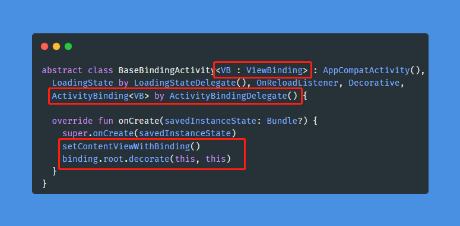
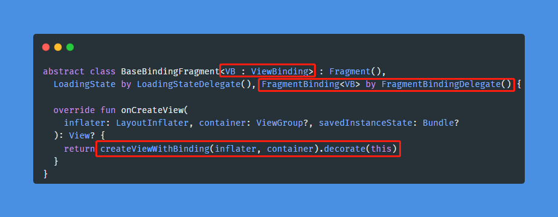
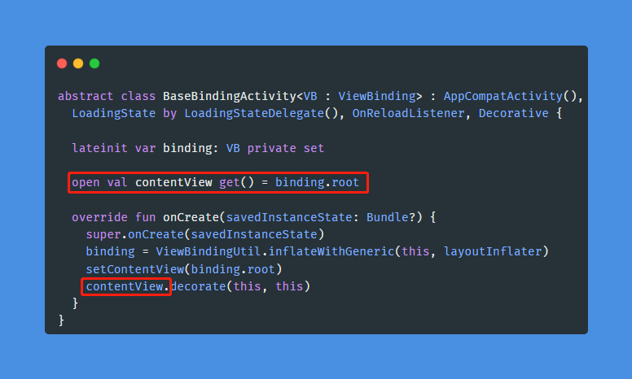
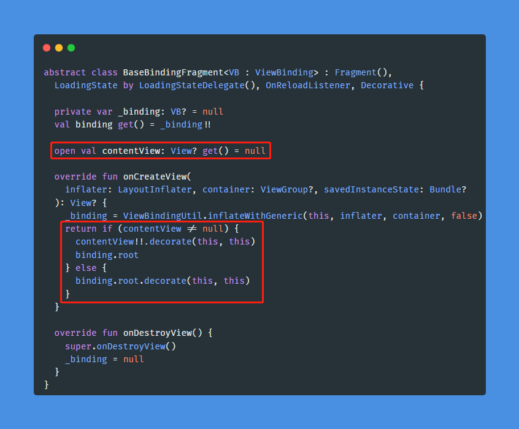

# 结合 ViewBinding 使用

## 基础用法

如果要同时使用 `LoadingStateView` 和 `ViewBinding`，需要先得到对应的 `ViewBinding` 实例，再用其根视图去创建 `LoadingStateView`。

<!-- tabs:start -->

#### **Kotlin**

```kotlin
val loadingStateView = LoadingStateView(binding.root, onReloadListener)
```

#### **Java**

```java
LoadingStateView loadingStateView = new LoadingStateView(binding.getRoot(), onReloadListener); 
```

<!-- tabs:end -->

## Kotlin 委托用法

委托用法再结合上 ViewBinding 才是个人理想中的用法。会使用到个人的另一个库 [ViewBindingKTX](https://github.com/DylanCaiCoding/ViewBindingKTX)，可以快速集成 ViewBinding 到基类中。

添加依赖：

```groovy
implementation 'com.github.DylanCaiCoding.ViewBindingKTX:viewbinding-base:2.0.6'
```

根据[文档](https://dylancaicoding.github.io/ViewBindingKTX/#/zh/baseclass)集成 ViewBinding，再对 ViewBinding 的根视图进行装饰。以下是在委托用法基础上修改的代码：

<!-- tabs:start -->

#### **Activity**



#### **Fragment**



<!-- tabs:end -->

由于给基类增加了 ViewBinding 泛型，会影响到已有基类的使用。那么对于已有的项目，建议继承原基类扩展出一个支持 ViewBinding 的基类。

我们还可以再改进一下，增加一个 `open val contentView` 属性，修改如下。

<!-- tabs:start -->

#### **Activity**



#### **Fragment**



<!-- tabs:end -->

这样重写 `contentView` 属性可任意指定显示缺省页的区域，比如用了 `DrawerLayout`，那么需要在 `DrawerLayout` 的子容器显示缺省页。

```kotlin
class MainActivity : BaseBindingActivity<ActivityMainBinding>() {

  // ...
  
  override val contentView get() = binding.contentContainer
}
```